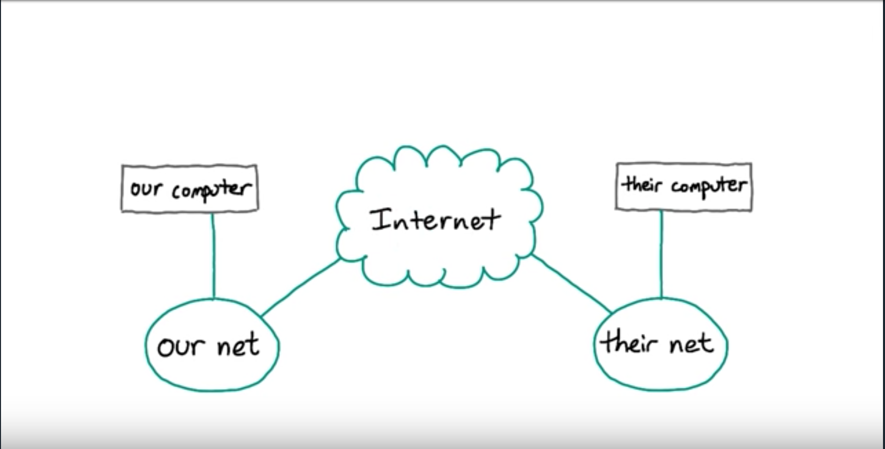
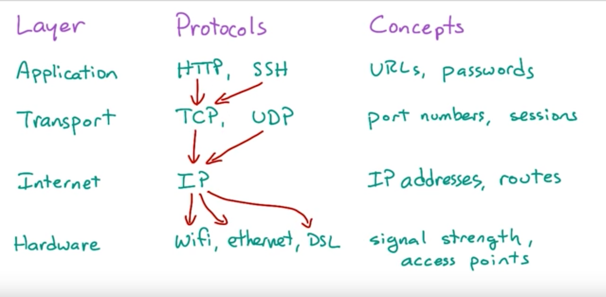
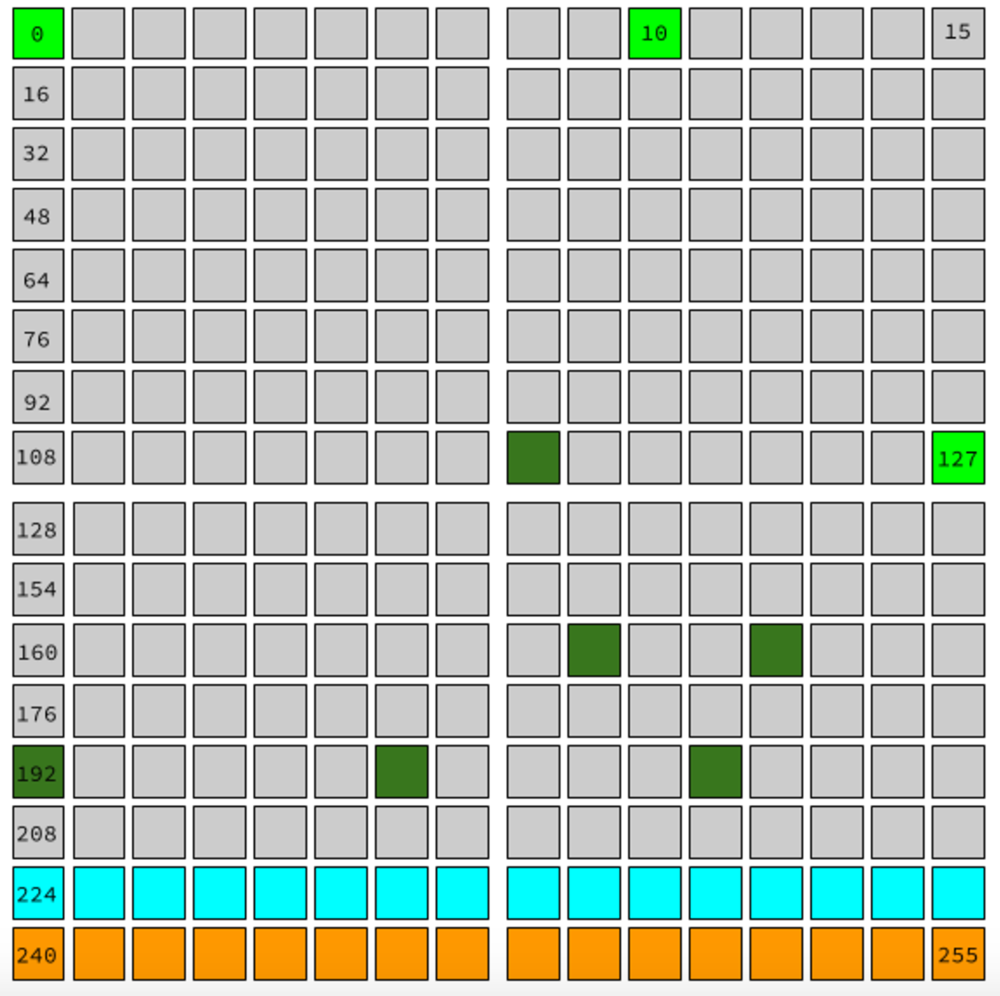
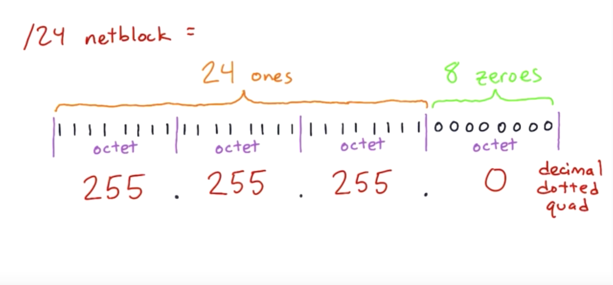
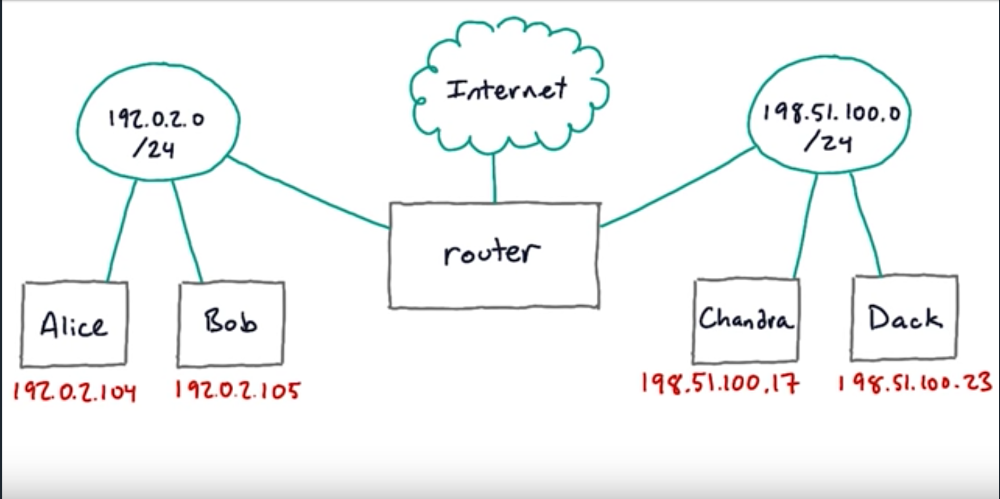

## Setting up for this course
### Your Linux machine

Your Linux machine (Local VM option)
The instructions in this section are for those who prefer to use a local virtual machine.

#### You will need to install two pieces of software:

* VirtualBox, which you can get from this [download page](https://www.virtualbox.org/wiki/Downloads).
* Vagrant, which you can get from this [download page](https://www.vagrantup.com/downloads.html).
* You will also need a Unix-style terminal program. On Mac or Linux systems, you can use the built-in Terminal. On Windows, we recommend Git Bash, which is installed with the Git version control software.

#### Once you have VirtualBox and Vagrant installed, open a terminal and run the following commands:

* `mkdir networking`
* `cd networking`
* `vagrant init ubuntu/trusty64`
* `vagrant up`

This will create a new directory for this course and begin downloading a `Linux image` into this directory. It may take a long time to download, depending on your Internet connection.

When it is complete, you can log into the Linux instance with `vagrant ssh`. You are now ready to continue with the course.

If you log out of the Linux instance or close the terminal, the next time you want to use it you only need to run `cd networking` and `vagrant ssh`.

----

### Installing networking tools
SSH into your Linux machine. Then take a moment to bring it up to date with any package updates: `sudo apt-get update && sudo apt-get upgrade`

Depending on how recently that machine was set up, you may get messages asking whether it's OK to install various packages or change various files. It should be safe to accept any changes the updater proposes to make.

`(If you haven't seen it before, the && in the above command means "run the first program; then if that succeeds, run the second program." Useful shell trick.)`

There are two reasons to do this update now: first, it's a good practice to keep your servers up to date; and second, if you don't update it, the new software for this course may not install correctly.

#### You'll be using several network utility programs in this course. Some of them may already be installed, but just to make sure, let's install them all:

`sudo apt-get install netcat-openbsd tcpdump traceroute mtr`

Once this installation completes, your machine is ready to do the exercises in this course.

### Getting the Taste :

##### To get a taste now let's try a command :

`ping -c3 8.8.8.8`

Ping is a command for testing wether your computer can send and network traffic
with a given address. Here, 8.8.8.8 is a particular service at Google.
Here `-c3` means to send three test messages and quit and print out the results.

#### Note : All of the following function on TCP Server (1 Level below HTTP)

##### Listening to a port using NetCat :
To listen to a specific port for a connection the command is `nc -l portNum`
where portNum represents the port number to listen to.

##### Connecting via NC Listen :
Open up a couple of ssh sessions on the linux box.
In one of them run `nc -l 1234` which makes that ssh session listen to the port number `1234`.
In the other window then run `nc localhost 1234` which makes the session connect to the
port number `1234`.
Now one ssh session is listening and the other is connected to the same port number.
Both of the ssh sessions are now capable of sending and receiving data on the port.

`NOTE : There is no HTTP involved, it's a plain TCP Server`

To Disconnect from the connection Just use the basic UNIX/LINUX exit command on the terminal.

### Experiment with nc and HTTP :
To get a better understanding of what netcat can do here, take another look at the nc manual page. Specifically, there's a section in there titled "Talking to Servers". Take a look at that section. Then, using what you learn there and what you've seen already in this lesson, try some experiments of your own with nc and web servers.

#### Here are some ideas :

##### Sending HTTP headers :
When you send an HTTP request using nc, the headers occur on lines after the HTTP verb itself. The Host: header you've seen in the previous exercises is required by the HTTP 1.1 protocol. What happens if you make requests that don't provide this header?

Are there other headers that it might be interesting to try sending? You can find a list of HTTP headers at Wikipedia.

What happens if you send a header you just made up?

What happens if you send an HTTP verb you just made up, instead of GET or HEAD or POST or the other real ones?

#### Interpreting responses :
If you send a well-formed request for host www.udacity.com to the Udacity web server, you may get back a 302 Found response with a Location: header. What does this header mean? What would a browser do in response to receiving that header?

#### Fetching content :
Most of the requests you have sent using nc are HEAD requests. HEAD is an HTTP verb that asks the server to send just the headers for a resource, rather than sending the full data. You can do GET requests as well, though:

`printf "GET / HTTP/1.1\r\nHost: www.example.com\r\n\r\n" | nc www.example.com 80`

How would you separate the headers from the data in the response you get here?

If you would like to save the results of an nc command to a file, you can do this with the > shell redirection operator. For instance, this will save the results to the file example.txt:

`printf "GET / HTTP/1.1\r\nHost: www.example.com\r\n\r\n" | nc www.example.com 80 > example.txt`

----

### Ports :

#### Below are some of the following points to remember :

* Minimum Port number to which a ssh can listen : 1024 (1023 and below reserved for superuser)
* Maximum Port number to which a ssh can listen : 65535 (not an arbitrary limit)

NOTE : In order to listen to ports below 1024 run the command as root using sudo

If more than one ssh session try to listen to a single port, then, NetCat gives an error
 `nc : Address already in use`

 Normally one program can listen to a port at one time but once the program starts,
 it can run threads or child processes which can handle the incoming traffic on the port.
 This is the methodology used by a webserver to handle more than one connection at a time.
 `nc -l` is not able to do this because it is not a proper server but just a listener which
 accepts a single connection

 There is a standard linux program which can be used to find out which programs are listening
 to a port named `lsof`
 The lsof program name stands for `List open Files`

##### Use `sudo lsof -i` to list only network sockets. The commands listening will have a `(LISTEN)`

#### Hosts :
A machine on the internet that might host services.

#### End Points :
Two programs or machines communicating over the network.

-----

### DNS :
The Domain Name System (DNS) is a hierarchical decentralized naming system for computers, services, or other resources connected to the Internet or a private network. It associates various information with domain names assigned to each of the participating entities.

In simple words DNS is a worldwide distributed directory of network information, It stores
a wide variety of records but the best known kind of DNS is the A Record, which maps a name like
www.example.com to an IPv4 Address. Client programs such as web browsers look up these records
in order to find the address of a website or a web service.
DNS Domains are also used as a part of security mechanisms like HTTP, including SSL encryption and Cookie Privacy.

DNS is a distributed directory with some root servers all around the world, which direct requests to top-level domain servers like for `.com` which in turn forward requests to the Domain Servers therefore eradicating the need for a DNS server to have all the cords for domains around the world. For every client request, there is a Caching DNS Server which handles the requests. Resolvers usually talk to Caching DNS Servers which in turn look into their cache and return the necessary details back to the client. If the Caching Server doesn't have the required data, it will then forward the request to a Root Server (might even be to a top/low level domain server), store the details returned by the Root Server in it's Cache and then return the data to the Client.

DNS Records also have a Time to Live (TTL) which is tells caches how long to cache them for. After that particular time period the caching servers have to go back to the authoritative server back again and look the record up to ensure that the information they have is fresh.

##### The Resolver : DNS Client code built into your operating systems

### Host :
The host command is a basic utility for looking up records in DNS. It will query the OS Name Service, which usually ends up sending a request to whatever DNS server your computer's configured to use.

#####`Quick Look` : run `host -t a example.com` and it will return the IPv4 Address for it.

### Dig :
The dig command does the same job as that of host but it returns the results in a more readable form for scripts. It has a Question Section containing what we sent and an Answer Section with what we got in return to that request.
Dig also tells us which server answered our query, and also has some other fields which specify how did the query work

----

#### Some Important Keys :

* A Canonical Name record (abbreviated as CNAME record) is a type of resource record in the Domain Name System (DNS) used to specify that a domain name is an alias for another domain, which is the "canonical" domain.

* The AAAA Record. Much like the A record is to the IPv4 address space, the AAAA record (also known as a quad-A record) is to the IPv6 address space. An easy way to remember this is IPv4 addresses are 32 bits, and IPv6 addresses are 128 bits, so if an A record is 32 bits, 4xA (or AAAA) is 128 bits

* An NS record is used to delegate a subdomain to a set of name servers. Whenever you delegate a domain to DNSimple the TLD authorities place NS records for your domain in the TLD name servers pointing to us.

### Sub Domains and FQDNS :

DNS domains are structured as a tree with `.com` at the top hierarchy and `.edu, .net` next to it.
There is a collection of servers which are responsible for storing all the domains.
Now, `www.example.com` is a subdomain of `example.com` and so `test.www.example.com` is a subdomain of `www.example.com` .
There is a possibility that there may be a host with an IP Address and an A Certificate, and there can be a different host for the subdomain.
These days many organizations have their domain pointed at `example.com` with a C-NAME or an alias set at `www.example.com`.

##### Seach Domain :  setting in the resolver configuration that makes the resolver look up names inside a domain

-----

### IPv4 :
This is the older version of IP which is used by majiority. These are usually written as dotted quads that is four numbers seperated by dots.
Each of this numbers is 1 byte or 8 bits which means it can have a value from anything between 0-255.  
`Example : 127.0.0.1`   
Here, not all of the 32 bits can b used to assign real addresses. Some of them are reserved for special protocols, internal private networks , testing.  
Here's a visualization of the entire IPv4 address space. Each square represents one possible value of the first octet of an address. For instance, the square on the top right, labeled 15, represents all the IPv4 addresses that start with 15 as their first octet.  

    

Here :

* The light-green squares (`0, 10, and 127`) are blocks that are entirely reserved.
* The dark-green squares are blocks that are partly reserved. For instance, not all of the `192` block is reserved, but some of it is.
* The entire cyan row (`starting at 224`) is set aside for [IP multicast](https://en.wikipedia.org/wiki/IP_multicast).
* And the entire orange bottom row (starting at 240) `was originally set aside for "future use" but was effectively lost due to being blocked as invalid`. No, really. We lost 1/16th of all IPv4 addresses due to mistaken planning.

-----

Earlier we noticed the highest port number we can connect to to using nc is 65535.
The reason for that is the port number field in the TCP packet header is 16 bits wide and it cannot exceed a value more than 65535.

-----

Systems which are on a same network usually have a similar IP to each other. To be more specific,
All of the addresses on a specific network block share a particular prefix. They all start the same and differ after a particular bit position.   
Computers which are on the same network usually can talk to other computers without going through the router.
A network prefix length is something to be chosen before the network is setup because it further determines the number of hosts that can connect to the network.   
For instance if you have a network with 16 bit prefix, it means there are 16 bits left for the hosts. We would conventionally write it as : 198.100.0.0/16    
`Number of hosts for a network` : 2(host bits)     

NOTE : 3 addresses are reserved. Therefore Available addresses for use are (total-3)

### Subnet Mask :

A subnet mask is a screen of numbers used for routing traffic within a subnet. Once a packet has arrived at an organization's gateway or connection point with its unique network number, it can be routed to its destination within the organization's internal gateways using the subnet number.

In other words,   
It is a binary number with one's on the left and zeroes on the right to indicate the size of the network. They are often seen in network configuration of the hosts.   
Like IPv4, Subnet Masks have a 32 bit value which is also written as decimal dotted quads.

### Drawbacks of IPv4 :

Since there are only a limited number of bits which can be assigned for serving addresses to hosts
even one of which are reserved, there arises a big problem of availability of an unique IP Address
for each user around the globe.  
Since Packet Delivery works on the basis of source and destination IP therefore this shortage of IP
is a problem which was fixed by IPv6.

### The Truth about IP Addresses :

The host does not ever have an IP Address, rather the Interface on the host is assigned an IP Address. A host can have multiple network interfaces and each interface might have one or more addresses.     
On Linux the interfaces can be found with : `ip addr show`
On Mac or UNIX : `ifconfig | less`

##### LoopBack :
The Loopback is a special interface that almost always have the IP Address `127.0.0.1`.
It helps communication over the Local Network Stack. Anytime you have been using your localhost, it is the Loopback in action.

### Routers and Default Gateways :
In general Router is a device which helps connect two IP Networks. It acts as a gateway. Hosts on one network want to send traffic to the other one, forward that traffic through router. The router always holds two IP addresses one from each network and one IP Address provided by the ISP.

##### We can find the Default Gateway Using :
* Linux : `ip route show default`
* Max|Unix : `netstat -nr`

### NAT :

Network address translation (NAT) is a method of remapping one IP address space into another by modifying network address information in Internet Protocol (IP) datagram packet headers while they are in transit across a traffic routing device.[1] The technique was originally used for ease of rerouting traffic in IP networks without readdressing every host. In more advanced NAT implementations featuring IP masquerading, it has become a popular and essential tool in conserving global address space allocations in face of IPv4 address exhaustion by sharing one Internet-routable IP address of a NAT gateway for an entire private network.      

IP masquerading is a technique that hides an entire IP address space, usually consisting of private IP addresses, behind a single IP address in another, usually public address space. The address that has to be hidden is changed into a single (public) IP address as "new" source address of the outgoing IP packet so it appears as originating not from the hidden host but from the routing device itself. Because of the popularity of this technique to conserve IPv4 address space, the term NAT has become virtually synonymous with IP masquerading.       

As network address translation modifies the IP address information in packets, it has serious consequences on the quality of Internet connectivity and requires careful attention to the details of its implementation. NAT implementations vary widely in their specific behavior in various addressing cases and their effect on network traffic. The specifics of NAT behavior is not commonly documented by vendors of equipment containing implementations.      

----------

### IPv6 :

Internet Protocol version 6 (IPv6) is the most recent version of the Internet Protocol (IP), the communications protocol that provides an identification and location system for computers on networks and routes traffic across the Internet. IPv6 was developed by the Internet Engineering Task Force (IETF) to deal with the long-anticipated problem of IPv4 address exhaustion. IPv6 is intended to replace IPv4. It is 128 bits (4 times that of IPv4) giving a really long IP Address but in turn also solving the major issue of IPv4. Moreover, They are written in hex digits, in blocks of 2 bytes separated by colons.   
This has now eliminated the need for NAT as there are enough IP Addresses for each device.  
For testing if you have an IPv6 or not visit http://test-ipv6.com
